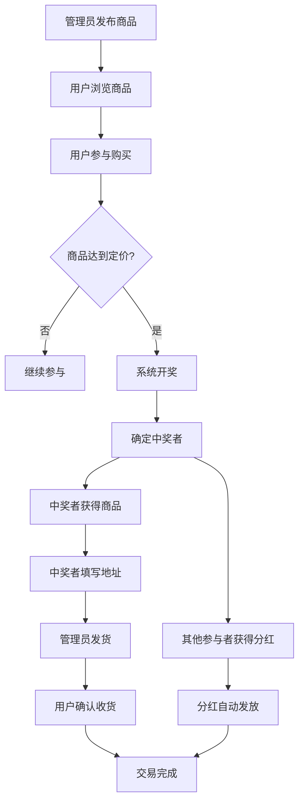

# Treasure 项目开发文档

> GitHub仓库地址: [https://github.com/yszhouwei/Treasure.git](https://github.com/yszhouwei/Treasure.git)

## 1. 项目概述

Treasure 是一个包含H5客户端和PC管理后台的现代化Web应用程序，旨在提供直观、美观且功能丰富的用户体验。本项目采用前沿的技术栈构建，注重性能、可维护性和可扩展性。

### 1.1 项目目标
- 提供现代化且大气的界面设计
- H5客户端支持移动端访问
- PC管理后台支持桌面端操作
- 构建高性能、高可用的应用系统
- 遵循最佳实践和编码标准

### 1.2 核心特性
- 清晰的视觉层次和布局
- 蓝色主题配色方案
- 美观的按钮和交互元素
- 简洁而专业的视觉效果
- 响应式设计支持多端适配

## 2. 技术栈

### 2.1 前端技术
- **框架**: React 18.x 
- **状态管理**: Redux Toolkit
- **构建工具**: Vite 4.x
- **语言**: TypeScript 5.x
- **UI组件库**: Ant Design Mobile（H5客户端）/ Ant Design（PC管理后台）
- **样式**: TailwindCSS
- **路由**: React Router 6.x

### 2.2 后端技术
- **运行环境**: Node.js 18.x+
- **框架**: NestJS
- **数据库**: MySQL 8.0+
- **ORM**: TypeORM
- **API规范**: RESTful API

### 2.3 开发工具
- **包管理器**: pnpm 8.x
- **代码编辑器**: VS Code
- **版本控制**: Git
- **代码质量**: ESLint, Prettier
- **测试工具**: Jest, Cypress

## 3. 项目结构

```
treasure/
├── client-h5/              # H5客户端
│   ├── public/             # 静态资源
│   ├── src/                # 源代码
│   │   ├── assets/         # 图片、图标等资源
│   │   ├── components/     # 可复用组件
│   │   ├── layouts/        # 页面布局
│   │   ├── pages/          # 页面组件
│   │   ├── routes/         # 路由配置
│   │   ├── services/       # API服务层
│   │   ├── store/          # 状态管理
│   │   ├── styles/         # 全局样式
│   │   ├── utils/          # 工具函数
│   │   ├── App.tsx         # 根组件
│   │   └── main.tsx        # 入口文件
│   ├── index.html          # HTML模板
│   ├── tsconfig.json       # TypeScript配置
│   └── vite.config.ts      # 构建配置
├── admin-pc/               # PC管理后台
│   ├── public/             # 静态资源
│   ├── src/                # 源代码
│   │   ├── assets/         # 图片、图标等资源
│   │   ├── components/     # 可复用组件
│   │   ├── layouts/        # 页面布局
│   │   ├── pages/          # 页面组件
│   │   ├── routes/         # 路由配置
│   │   ├── services/       # API服务层
│   │   ├── store/          # 状态管理
│   │   ├── styles/         # 全局样式
│   │   ├── utils/          # 工具函数
│   │   ├── App.tsx         # 根组件
│   │   └── main.tsx        # 入口文件
│   ├── index.html          # HTML模板
│   ├── tsconfig.json       # TypeScript配置
│   └── vite.config.ts      # 构建配置
├── server/                 # 后端服务
│   ├── src/                # 源代码
│   │   ├── controllers/    # 控制器
│   │   ├── models/         # 数据模型
│   │   ├── routes/         # 路由
│   │   ├── middleware/     # 中间件
│   │   ├── utils/          # 工具函数
│   │   └── app.ts          # 应用入口
│   ├── .env.example        # 环境变量示例
│   └── package.json        # 后端依赖
├── docs/                   # 文档
├── tests/                  # 测试文件
├── .gitignore              # Git忽略文件
├── README.md               # 项目说明
└── package.json            # 根依赖配置
```

## 4. 开发环境搭建

### 4.1 前置要求
- Node.js >= 18.0.0
- pnpm >= 8.0.0
- Git

### 4.2 项目获取
从GitHub克隆项目仓库：
```bash
git clone https://github.com/yszhouwei/Treasure.git
cd Treasure
```

### 4.3 安装步骤

1. 进入对应的项目目录：
   ```bash
   # H5客户端
   cd client-h5
   
   # 或PC管理后台
   cd admin-pc
   
   # 或后端服务
   cd server
   ```

2. 安装前端依赖：
   ```bash
   cd client
   pnpm install
   ```

3. （如果存在后端）安装后端依赖：
   ```bash
   cd ../server
   pnpm install
   ```

4. 启动开发服务器：
   ```bash
   # 前端开发服务器
   cd client
   pnpm dev
   
   # 后端开发服务器（如适用）
   cd server
   pnpm dev
   ```

## 5. 编码规范

### 5.1 命名约定
- 使用 PascalCase 命名 React 组件：`UserProfile.tsx`
- 使用 camelCase 命名变量和函数：`getUserData()`
- 使用 UPPER_SNAKE_CASE 命名常量：`MAX_RETRY_COUNT`
- 使用 kebab-case 命名文件：`user-profile.tsx`

### 5.2 TypeScript 规范
- 所有组件和函数都应有明确的类型定义
- 尽量避免使用 `any` 类型
- 使用接口而非类型别名定义对象结构

### 5.3 React 组件规范
- 优先使用函数组件和 Hooks
- 组件文件应导出单一默认组件
- 复杂组件应拆分为更小的可复用组件

## 6. 组件设计原则

### 6.1 设计理念
遵循现代化且大气的界面设计理念，确保：
- 清晰的信息架构和视觉层次
- 一致的设计语言和交互模式
- 良好的可访问性和响应式体验

### 6.2 组件分类
- **基础组件**: 按钮、输入框、标签等
- **布局组件**: 网格、卡片、导航栏等
- **业务组件**: 特定于业务逻辑的复合组件

### 6.3 组件实现要点
- 组件应具有清晰的职责边界
- 支持自定义样式和主题
- 提供完整的 TypeScript 类型定义
- 包含必要的单元测试

## 7. 界面设计指南

### 7.1 色彩体系
- 主色调：深蓝色 (#1890ff)
- 辅助色：浅蓝 (#40a9ff)、绿色 (#52c41a)、红色 (#ff4d4f)
- 中性色：白 (#ffffff)、灰 (#f0f0f0, #d9d9d9, #bfbfbf, #8c8c8c, #595959, #262626)

### 7.2 字体规范
- 主字体：-apple-system, BlinkMacSystemFont, 'Segoe UI', Roboto, 'Helvetica Neue', Arial, sans-serif
- 字号：标题 (24px/20px/18px)、正文 (16px)、辅助文字 (14px/12px)

### 7.3 间距规范
- 基础单位：8px
- 组件内间距：8px/16px/24px
- 组件外间距：16px/24px/32px

### 7.4 响应式设计
- 断点设置：
  - xs: < 576px
  - sm: 576px - 768px
  - md: 768px - 992px
  - lg: 992px - 1200px
  - xl: 1200px - 1600px
  - xxl: ≥ 1600px

## 8. 测试策略

### 8.1 测试类型
- **单元测试**: 使用 Jest 测试核心逻辑和组件
- **集成测试**: 验证组件间的交互
- **端到端测试**: 使用 Cypress 进行完整功能测试

### 8.2 测试覆盖率
- 核心业务逻辑覆盖率应达到 90% 以上
- UI 组件覆盖率应达到 80% 以上
- 工具函数覆盖率应达到 100%

### 8.3 测试执行
```bash
# 运行所有测试
pnpm test

# 运行单元测试
pnpm test:unit

# 运行端到端测试
pnpm test:e2e
```

## 9. 部署流程

### 9.1 构建生产版本
```bash
cd client
pnpm build
```

### 9.2 部署环境
- **静态文件托管**: Nginx / Vercel / Netlify
- **后端服务**: Docker 容器化部署
- **数据库**: 云数据库服务

### 9.3 CI/CD 流程
1. 代码提交到 feature 分支
2. 创建 Pull Request
3. 自动化测试通过后合并到 main 分支
4. 自动部署到预发布环境
5. 手动批准后部署到生产环境

## 10. 需求分析与功能规划

### 10.1 核心需求
Treasure 项目的核心需求围绕提供优质的用户体验展开：

1. **双端适配**
   - H5客户端针对移动设备优化
   - PC管理后台针对桌面操作优化
   - 统一的后端服务支撑两端业务

2. **用户友好的界面设计**
   - 实现现代化且大气的界面风格
   - 采用蓝色主题配色方案
   - 确保清晰的布局和视觉层次

3. **高性能表现**
   - 快速加载时间
   - 流畅的交互体验
   - 优化的资源管理

4. **完善的业务功能**
   - H5客户端提供完整的用户端功能
   - PC管理后台提供强大的管理功能
   - 数据统计与分析能力
   - 团队管理功能（支持10人团、20人团、50人团、100人团）
   - 团队长权限体系（由管理后台创建和管理，每个团队长拥有独立团队）
   - 财务支付功能（支持多种支付通道）
   - 电商交易功能（商品购买、开奖、分红机制）
   - 运营推广功能（帮助团队长进行推广和统计）
   - 供应链管理功能（商品、采购、供应商、物流管理）

5. **可扩展性架构**
   - 模块化设计便于功能扩展
   - 清晰的代码结构利于团队协作

### 10.2 功能模块划分

#### 核心功能模块

##### H5客户端功能模块
1. **用户认证系统**
   - 用户注册（手机号/邮箱注册）
   - 用户登录（账号密码/短信验证码登录）
   - 第三方登录（微信、QQ等）
   - 密码找回与重置
   - 用户信息管理

2. **主页展示**
   - 轮播图展示
   - 推荐内容列表
   - 分类导航
   - 活动公告
   - 团队展示区（显示10人团、20人团、50人团、100人团）
   - 团队长推荐
   - 商品推荐展示

3. **内容浏览功能**
   - 内容分类浏览
   - 内容详情查看
   - 内容收藏与分享
   - 评论与点赞

4. **商品浏览功能**
   - 商品分类浏览
   - 商品详情查看
   - 商品收藏与分享
   - 商品评价查看

5. **团队功能**
   - 团队信息查看（仅限所属团队）
   - 团队成员查看（仅限所属团队）
   - 团队活动参与
   - 团队推广素材使用
   - 团队业绩查看

6. **搜索功能**
   - 关键词搜索
   - 分类筛选
   - 搜索历史记录

7. **个人中心**
   - 个人信息维护
   - 我的收藏
   - 浏览历史
   - 消息通知
   - 设置管理
   - 财务中心
   - 支付记录查看
   - 退款申请
   - 我的订单
   - 参与记录查看
   - 中奖记录查看

##### PC管理后台功能模块
1. **用户管理**
   - 用户列表查看
   - 用户信息编辑
   - 用户权限管理
   - 用户状态控制
   - 团队长权限设置
   - 团队长账户创建与管理

2. **内容管理**
   - 内容发布与编辑
   - 内容分类管理
   - 内容审核机制
   - 内容推荐设置

3. **商品管理**
   - 商品信息管理
   - 商品分类管理
   - 商品上架/下架
   - 商品库存管理
   - 商品推荐设置

4. **采购管理**
   - 采购计划制定
   - 采购订单管理
   - 采购入库管理
   - 供应商对接

5. **供应商管理**
   - 供应商信息管理
   - 供应商资质审核
   - 供应商合作记录
   - 供应商评价管理

6. **物流管理**
   - 物流公司管理
   - 物流订单跟踪
   - 配送区域管理
   - 运费模板设置

7. **团队管理**
   - 团队创建与信息管理
   - 团队长账户创建与权限设置
   - 团队成员管理
   - 团队规模配置（10人团、20人团、50人团、100人团）
   - 团队数据统计与分析
   - 团队推广效果统计
   - 团队业绩排行榜管理

8. **数据统计**
   - 用户活跃度统计
   - 内容浏览量统计
   - 商品销售统计
   - 收入数据统计
   - 数据可视化展示

9. **系统配置**
   - 系统参数设置
   - 菜单权限管理
   - 角色权限分配
   - 操作日志查看

10. **财务管理**
    - 支付通道配置
    - 支付订单管理
    - 退款审核
    - 财务报表生成
    - 对账功能
    - 分红管理

11. **运营推广管理**
    - 推广素材管理
    - 推广活动配置
    - 推广效果统计
    - 团队业绩排行榜
    - 推广奖励发放

#### 扩展功能模块
- 用户个人中心
- 数据统计面板
- 通知系统
- 设置管理
- 第三方集成
- 财务管理
  - 支付功能
  - 多种支付通道支持
  - 财务记录查询
  - 退款管理
- 电商功能
  - 商品管理
  - 采购管理
  - 供应商管理
  - 物流管理
- 运营推广功能
  - 团队长运营工具
  - 推广素材管理
  - 数据统计分析
  - 业绩排行榜

## 11. 开发任务计划

项目将采用敏捷开发方法，分阶段交付功能。每个阶段都有明确的目标和交付物。

### 阶段一：基础架构搭建（预计2周）

**目标**：建立项目基础架构，完成技术选型和环境配置

**主要任务**：
1. 初始化项目结构
   - 创建前后端项目骨架
   - 配置构建工具（Vite/Webpack）
   - 设置代码规范和linting规则

2. 技术栈确定与集成
   - 确定最终使用的框架和库
   - 集成状态管理方案
   - 配置路由系统

3. 开发环境配置
   - 设置开发、测试、生产环境
   - 配置自动化构建流程
   - 建立本地开发服务器

4. 基础UI组件库搭建
   - 实现基本样式系统
   - 创建常用基础组件（按钮、输入框等）
   - 建立组件文档

**交付物**：
- 可运行的项目骨架
- 完整的开发环境配置
- 基础组件库
- 技术文档

### 阶段二：核心功能开发（预计4周）

**目标**：实现产品的核心功能模块

**主要任务**：
1. 用户认证系统
   - 登录/注册页面设计与实现
   - JWT Token管理
   - 权限验证机制

2. 主页与导航系统
   - 响应式布局实现
   - 主导航菜单开发
   - 首页内容展示

3. 核心业务页面
   - 内容列表页面
   - 内容详情页面
   - 搜索功能实现
   - 商品展示页面
   - 团队展示页面

4. 状态管理和数据流
   - 全局状态设计
   - API接口集成
   - 错误处理机制

**交付物**：
- 完整的用户认证流程
- 可交互的主页和核心页面
- 完善的状态管理系统
- 单元测试覆盖

### 阶段三：扩展功能与优化（预计3周）

**目标**：完善产品功能，提升用户体验

**主要任务**：
1. 用户个人中心
   - 个人信息管理
   - 用户设置页面
   - 历史记录展示
   - 财务中心功能
   - 订单管理功能

2. 团队功能开发
   - 团队管理页面
   - 团队推广工具
   - 团队业绩展示

3. 电商功能完善
   - 商品管理后台
   - 支付流程优化
   - 开奖机制测试

4. 运营推广功能
   - 推广工具实现
   - 数据统计面板
   - 业绩排行榜

5. 性能优化
   - 代码分割和懒加载
   - 图片和资源优化
   - 加载性能调优

6. 用户体验改进
   - 动画和过渡效果
   - 表单验证增强
   - 错误提示优化

7. 测试完善
   - 端到端测试补充
   - 性能测试
   - 兼容性测试

**交付物**：
- 完整的用户个人中心
- 团队管理功能
- 电商交易功能
- 运营推广工具
- 优化后的用户体验
- 全面的测试覆盖
- 性能报告

### 阶段四：测试与部署（预计1周）

**目标**：确保产品质量，准备上线

**主要任务**：
1. 全面测试
   - 回归测试
   - 安全测试
   - 压力测试

2. 部署准备
   - 生产环境配置
   - 部署脚本编写
   - 监控和日志配置

3. 文档完善
   - 用户手册编写
   - API文档更新
   - 部署文档完善

**交付物**：
- 通过测试的产品版本
- 部署方案和文档
- 完整的用户文档

## 12. 里程碑计划

| 里程碑 | 时间节点 | 关键交付物 |
|--------|----------|------------|
| 项目启动 | 第1周 | 项目计划书、技术选型 |
| 基础架构完成 | 第2-3周 | 项目骨架、开发环境 |
| 核心功能完成 | 第4-7周 | 用户认证、主页、核心页面 |
| 扩展功能完成 | 第8-10周 | 个人中心、性能优化 |
| 测试与部署 | 第11周 | 上线版本、部署文档 |
| 正式上线 | 第12周 | 生产环境部署 |

## 13. 业务逻辑说明

### 13.1 整体业务流程



### 13.2 电商交易流程
1. **商品发布**
   - 管理员在后台发布商品，设置商品价格、库存、开奖条件等信息
   - 商品展示在H5客户端供用户浏览

2. **用户参与购买**
   - 用户在H5客户端浏览商品并下单购买
   - 支付成功后成为该商品的参与者
   - 系统记录所有参与者信息

3. **开奖机制**
   - 当商品达到设定的定价金额时自动开奖
   - 系统通过随机算法选出中奖者
   - 中奖者获得商品

4. **分红机制**
   - 未中奖的参与者根据规则获得相应分红
   - 分红金额来源于商品销售利润
   - 分红自动发放到用户账户

5. **物流配送**
   - 中奖者填写收货地址
   - 管理员安排发货并跟踪物流
   - 用户确认收货完成交易

### 13.2 团队机制
1. **团队结构**
   - 每个团队长都是独立的团队负责人
   - 团队长拥有独立的团队成员管理权限
   - 不同团队之间相互独立，数据隔离

2. **团队功能**
   - 团队长可查看和管理自己团队的成员
   - 团队长可查看团队业绩和分红情况
   - 团队长可组织团队活动
   - 团队长可使用推广工具进行运营推广
   - 团队长可查看推广效果统计数据

### 13.3 运营推广机制
1. **推广工具**
   - 提供多种推广素材（海报、链接、文案等）
   - 生成专属推广链接和二维码
   - 推广效果实时跟踪

2. **数据统计**
   - 推广浏览量统计
   - 推广转化率分析
   - 团队成员增长统计
   - 业绩排行榜展示

3. **激励机制**
   - 根据推广效果给予奖励
   - 定期举办推广竞赛活动
   - 优秀团队长表彰

### 13.4 角色权限说明
- **普通用户**：浏览商品、购买参与、查看参与记录、收货确认
- **团队长**：除普通用户权限外，可管理团队成员、查看团队业绩、组织团队活动、使用运营推广工具、查看推广统计数据、获取推广素材（每个团队长拥有独立的团队）
- **管理员**：商品管理、订单管理、用户管理、财务管理、数据统计、运营推广管理、推广素材管理等全部权限

---

## 14. 系统完整性与优势

### 14.1 系统完整性
Treasure系统是一个功能完整、业务闭环的电商平台，具备以下完整性特征：

1. **业务闭环**
   - 商品管理 → 用户购买 → 开奖机制 → 分红体系 → 物流配送
   - 形成完整的商业闭环，确保各环节无缝衔接

2. **功能全面**
   - 前端：H5客户端提供完整的用户购物体验
   - 后台：PC管理后台提供强大的运营管理能力
   - 系统：完整的供应链、财务、团队、推广管理体系

3. **数据完整**
   - 用户行为数据跟踪
   - 业务流程数据记录
   - 统计分析数据支撑决策

### 14.2 系统优势

1. **创新商业模式**
   - 结合电商与社交裂变的创新模式
   - 通过开奖和分红机制提升用户参与度
   - 团队长制度增强用户粘性

2. **强大的扩展性**
   - 模块化设计便于功能扩展
   - 微服务架构支持高并发
   - 灵活的配置管理系统

3. **完善的运营体系**
   - 全面的数据统计分析
   - 精准的用户画像
   - 有效的推广工具

4. **安全可靠的保障**
   - 多层次权限控制
   - 完善的数据备份机制
   - 严格的财务审计流程

---

*本文档将持续更新以反映项目的最新变化*